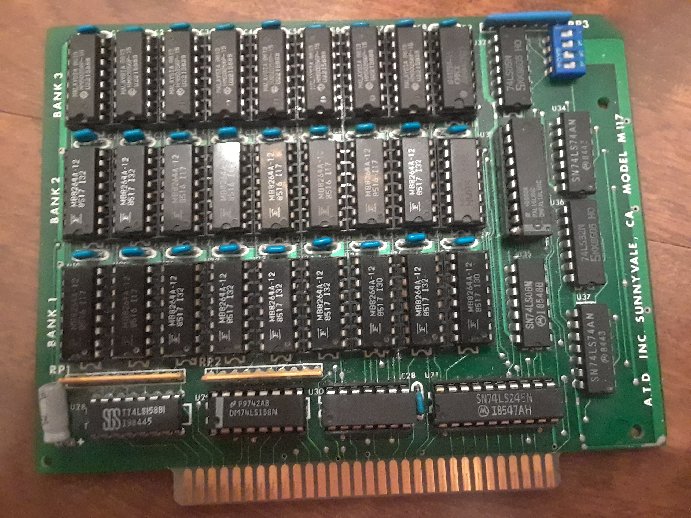

# `ATD M117`

The ATD Model M117 is an ancient memory expansion [ISA](https://en.wikipedia.org/wiki/Industry_Standard_Architecture) card for
IBM PC and compatibles, especially 8088-class systems. The M117 can expand a
system with up to 384kB of 4164-type and 41256-type DRAM, and the address ranges that
the card decodes is configurable using 4 DIP switches. Most of the card's intelligence
is inside a PAL16L8, whose behavior is configured using 3 of the 4 DIP switches.
This is the main reason the card is rather small.

Picture of my fully-populated ATD M117 card. The PAL is the 20 pin
socketed chip in the center-right. None of the chips were originally
socketed; it took me several tries to find the bad chip :)!

For the longest time, my M117 was broken, and I was not able to figure out why
thanks to not knowing the correct switch settings, which I changed from working
settings long ago. If the switch settings are on [TH99](http://www.uncreativelabs.de/th99/),
I was unable to find them. I knew from when I got the card that it supported at least
384kB of RAM, but 3 banks of 9 DRAM chips each implies that at least one bank will
have 256kB 41256-type DRAM. Not only did I never knew the switch settings, I forgot
_long_ ago which bank(s) should house the 41256 DRAM :).

I thought trying to fix the card would be a good learning experience, so I RE'd
a schematic to figure out the PAL connections (thank goodness for continuity testers!),
and then wrote some gateware to dump the PAL. Using some shell scripts and a
text editor, I looked for patterns in the PAL for all eight possible switch
settings. And finally, I was able to determine what each switch setting does :D!

Though I have my doubts, I have uploaded my schematic and switch REing results
here, in the hopes it is useful to someone else. I had fun and _willingly_ did
this project, but I wouldn't want someone else to be in my position.

## Documentation
* [PAL Signals](signals.md)
* [M117 Switches (and PAL Equations)](switches.md)
* [High-level schematic](schematic.md)

## Gateware

Although the main purpose of this repo is documentation, I have uploaded the
source to my FPGA tools I created for the [iCEBreaker](https://github.com/icebreaker-fpga)
to this repo as well for reference. The tools are written using the [Amaranth](https://github.com/amaranth-lang/amaranth)
HDL language. _All of these tools are one-offs, using Amaranth as sort of a scripting
language for fast turnaround. They are not in any way optimized for general usage,
and- at least for now- you use them at your own risk._

Each tool uses the iCEBreaker's UART and PMOD, and 5V ports to connect to a
breadboard and test/dump a 5V-powered TTL chip. I feed inputs from the iCEBreaker
directly to the chips, since 3.3V is a legal TTL voltage, and I use TXS0108E [breakout boards](https://www.amazon.com/dp/B06XWVZHZJ)
to connect outputs and/or bidirectional signals to the iCEBreaker.

### `paldump` PAL Dumper

I wrote `paldump` _very_ quickly to dump the PAL16L8 contents, after I knew
which each pin did as well as the directions for pins which can either be
inputs or outputs.

#### Connections

`paldump` will dump the raw contents of the PAL's "data" over the UART in order
from "address" 0 to 2047. I define each input pin as an "address" bit, and each
output pin as a "data" bit using the below table. The table also shows how to
connect each iCEbreaker pin to the PAL. PAL signals are described in [`signals.md`](signals.md).
**Pin Directions are from the POV of the PAL; make sure all PAL output pins are
level shifted down to 3.3V**. A level shifter OE signal is provided in the
table as well:

|Signal Name|Pin Direction|iCEBreaker Connection|PAL Pin|Address Bit|Data Bit|
|-----------|-------------|---------------------|-------|-----------|--------|
|5V         |PWR          |+5V                  |20     |N/A        |N/A     |
|GND        |PWR          |GND                  |10     |N/A        |N/A     |
|SW 1       |I            |PMOD1A 1             |1      |A0         |N/A     |
|SW 2       |I            |PMOD1A 2             |2      |A1         |N/A     |
|SW 3       |I            |PMOD1A 3             |3      |A2         |N/A     |
|A16        |I            |PMOD1A 4             |4      |A3         |N/A     |
|A17        |I            |PMOD1A 7             |5      |A4         |N/A     |
|A18        |I            |PMOD1A 8             |6      |A5         |N/A     |
|A19        |I            |PMOD1A 9             |7      |A6         |N/A     |
|Delayed /SMEM{R,W}|I     |PMOD1A 10            |8      |A7         |N/A     |
|/REFRESH   |I            |PMOD1B 1             |9      |A8         |N/A     |
|/SMEMW     |I            |PMOD1B 2             |18     |A9         |N/A     |
|/SMEMR     |I            |PMOD1B 3             |11     |A10        |N/A     |
|/WE All Banks|O          |PMOD2 1              |19     |N/A        |D0      |
|/RAS All Banks|O         |PMOD2 2              |17     |N/A        |D1      |
|Data Bus Direction|O     |PMOD2 3              |16     |N/A        |D2      |
|/CAS Bank 1|O            |PMOD2 4              |15     |N/A        |D3      |
|/CAS Bank 2|O            |PMOD2 7              |14     |N/A        |D4      |
|/CAS Bank 3|O            |PMOD2 8              |13     |N/A        |D5      |
|DRAM A8 All Banks|O      |PMOD2 9              |12     |N/A        |D6      |
|Level Shifter OE|I       |PMOD2 10             |N/A    |N/A        |N/A     |

#### Usage

Once [`amaranth`](https://amaranth-lang.org/docs/amaranth/latest/install.html)
and [`pyserial`](https://pyserial.reATDhedocs.io/en/latest/pyserial.html#installation)
are installed, you have to build the bitstream and upload it to your iCEBreaker.
_I suggest building and uploading this gateware before wiring up connections to
avoid input/output conflicts on the PMODs._

1. Run `python3 -m PALdump bitstream`. After several seconds, this command will
   upload the PAL dumping gateware to your iCEBreaker.
2. Wire up your PAL extracted from your M117 to your iCEBreaker, including a
   level shifter for the PAL outputs.
3. Run e.g. `python3 -m PALdump client COM10 ATD.txt` or `python3 -m PALdump client --csv COM10 ATD.csv`
   and follow the directions at the prompt; the reset button is "UBUTTON".
   Modify your serial port name as appropriate.
4. Your dumped PAL will be available in `ATD.txt` or `ATD.csv` if both dumps
   matched.
   * `.txt` and `.csv` outputs are what were useful to me at the time. Perhaps
     in the future, I'll add PAL fusemaps or `.jed` output.

### TTL/DRAM Tester

Even when I knew the correct switch settings, the card still didn't work. So I
used my logic analyzer to confirm that the signals the DRAM were receiving were
reasonable. It turns out one of the row/column address muxes- a 74LS158- had a
bit stuck high. While I manually tested the 74LS158 to confirm it was dead, it
got me motivated to write some gateware to automate testing certain TTL chips.
This code was written after-the-fact, using good and bad chip samples I have,
and is not ready yet.
