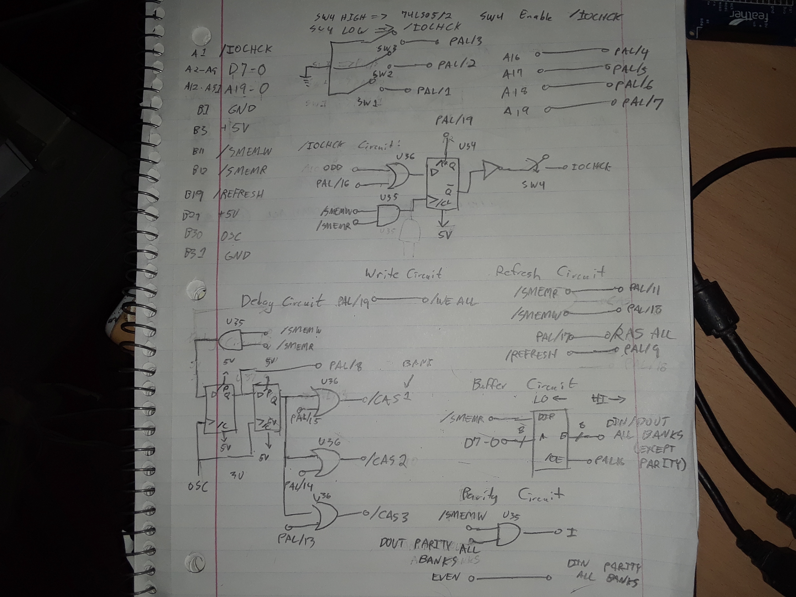
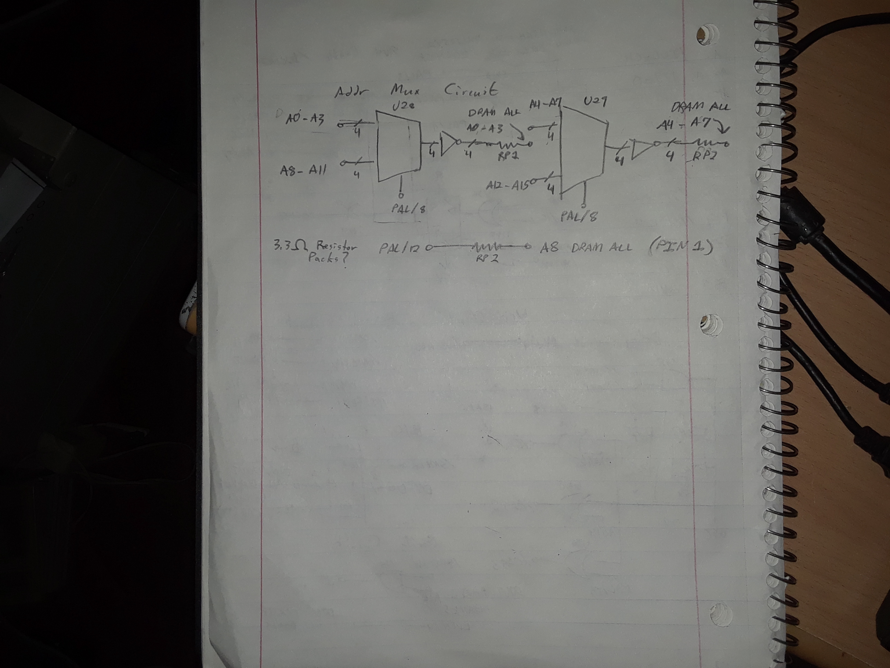

# High-Level M117 Schematic

TODO: I need to somehow convert this to electronic format beyond drawings. In
the meantime, my RE'd schematic is below. This drawing is not sufficient to
build a PCB; I only RE'd what I needed to fix the board, and connections to the
DRAM, the PAL, and parity circuit are implied:

Page 1:

Page 2:

TODO: I have added a few more annotations to these drawings since those
pictures were taken. I need some good lighting to take a photo :).
